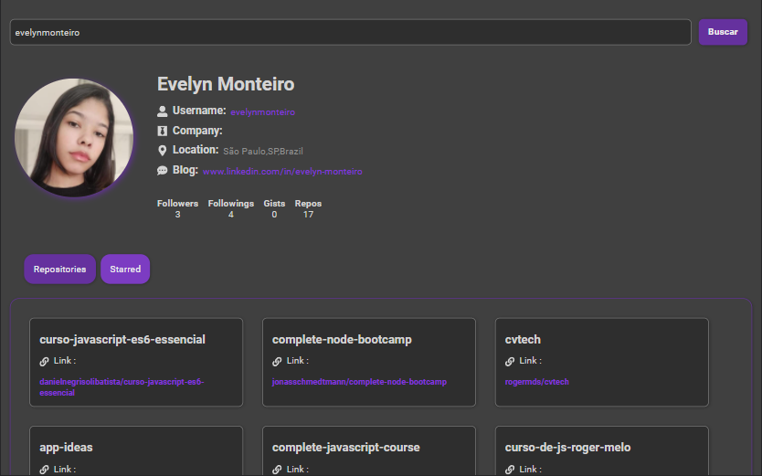

# Github API Profile

Profile for viewing information from Github.

## 🔎 About the Project

This repository was created in response to the proposed project / challenge within the Digital Innovation One platform.

I made some visual changes like the dark and purple theme as well as adding some icons with the 'react-icons' library.

### 📌 New Features and Improvements List

- Dark Theme
- Icons with [React-Icons](https://react-icons.github.io/react-icons)
- General design

## 👩🏻 Author

Made with 💜 by Evelyn Monteiro 👋
 

